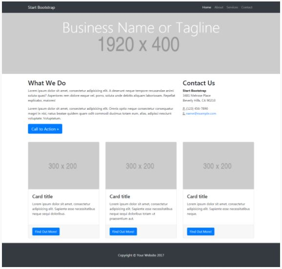
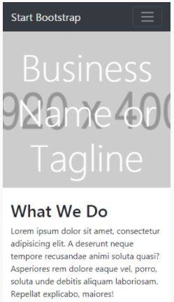
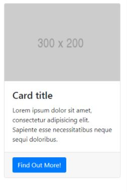

# My Page _(Mi página)_

## Sprint 3 Laboratoria. Retos de código.
El diseño lo puedes realizar como mejor te parezca, pero debes mantener la estructura de la página y debes realizarlo con un grid (cualquiera pero que no sea un framework como Bootstrap o Materialize). La estructura de la página es la siguiente:

  

### Descripción:
Página web responsiva, de 5 secciones principales: 1. Menú de navegación, 2. imagen principal, 3. información general y contacto, 4. Secciones de servicios, 5. Footer.
La página tiene una retícula de 12 divisiones no visibles, 3 columnas "visibles" que se transfroman en una al ser visitado desde celular.

## Resultado

